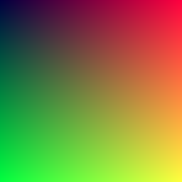
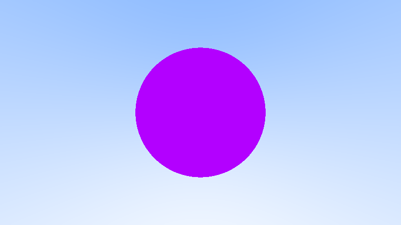
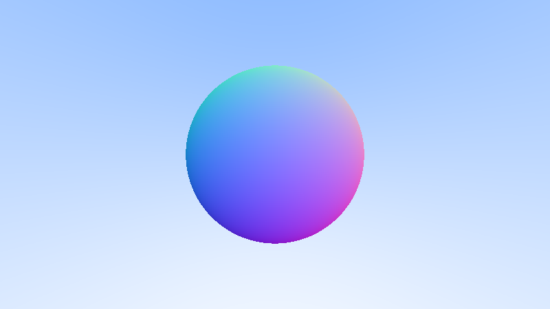
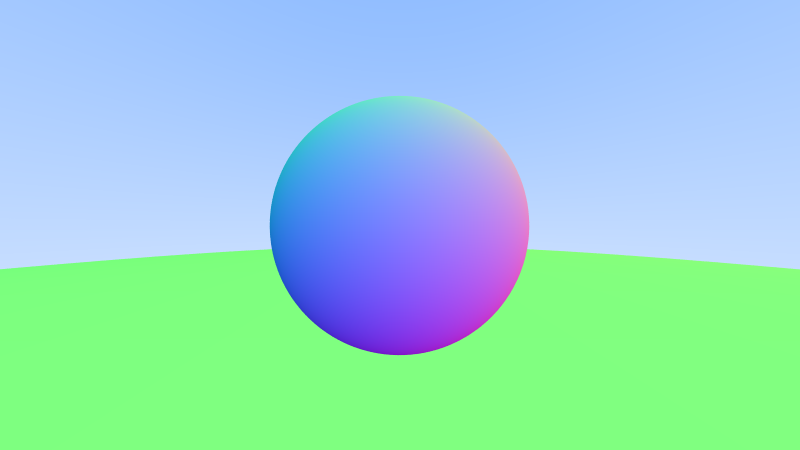
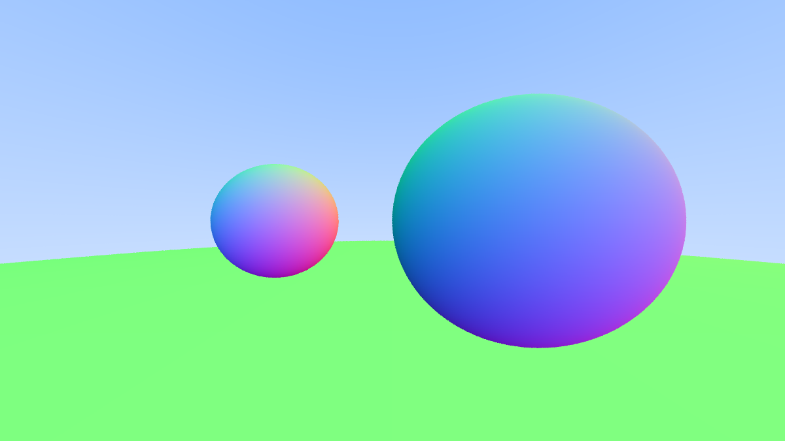
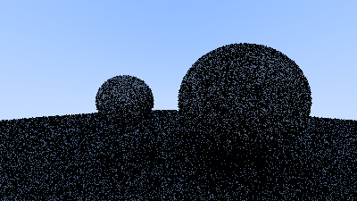
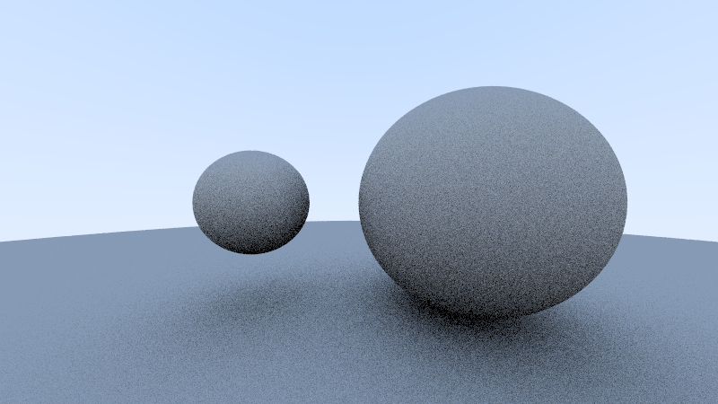
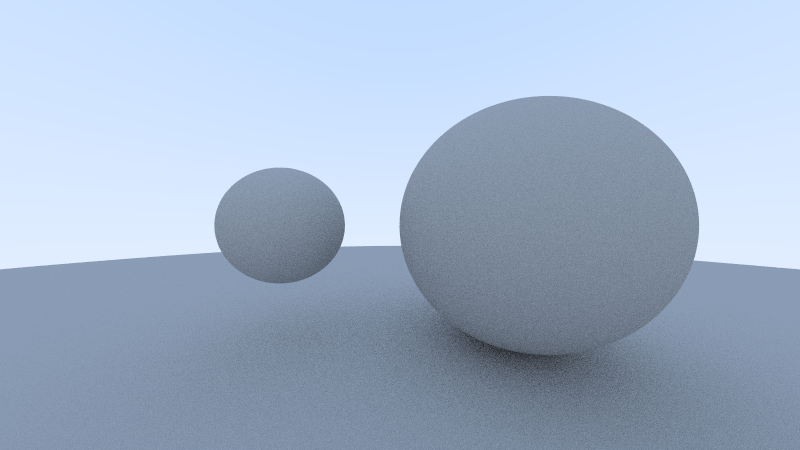
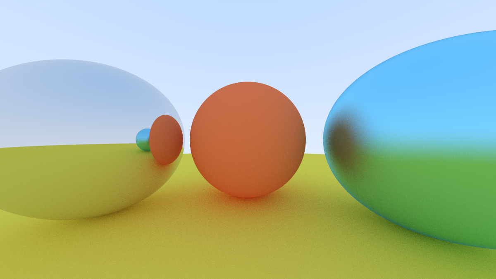

# Ray Tracer
A small ray tracer implemented in rust for the purpose of learning Rust using [Ray Tracing In One Weekend](https://raytracing.github.io/books/RayTracingInOneWeekend.html).

## The Journey
### Testing out the PPM output in Rust.

### First ray traced circle.

### Mapping surface norms to R/G/B. More volume-y now.

### Added Antialiasing.

### Building a word with a list of objects.

### Initial rendering of diffuse material using 1 ray bounce, very prominent shadow acne.
Diffuse material scatters light in random directions, giving the object a matte look. Should the ray bounce and hit nothing, the pixel takes on the background colour at half intensity.
Because of float point imprecision, sometimes the intersection is calculated to be inside of the spheres, which immediately returns a black pixel. This is somwhat remedied by biasing the minimum collision distance to be a very small positive float instead of 0.0.

### Upping the number of ray bounces to be traced.
Upping the number of ray bounces and output gamma corrected RGB values.
The spheres appear grey here due to the lack of self colouring so they take on different intensities of black and the background colour.

### Higher sampling rate.
Less grainy texture due the the more stable averages of the RGB values.

### Add materials and ray scattering behaviour (lambertian and metals).

